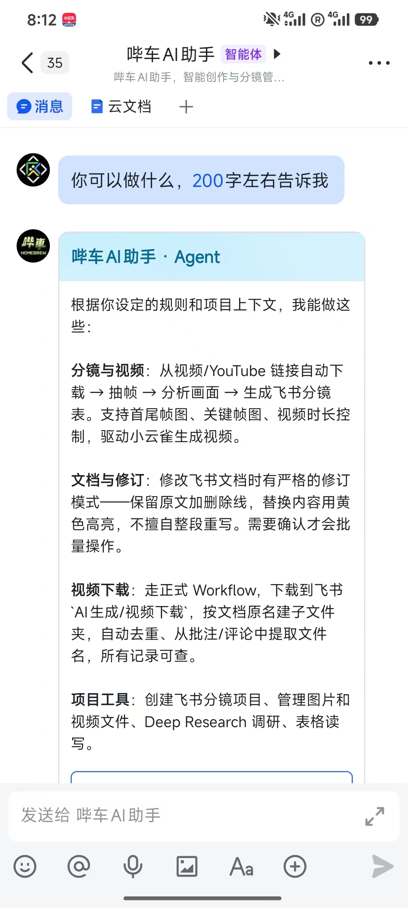
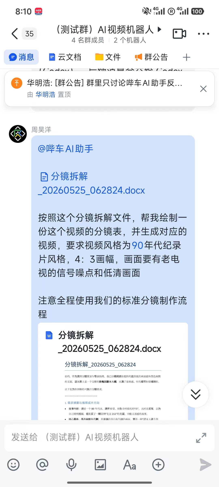
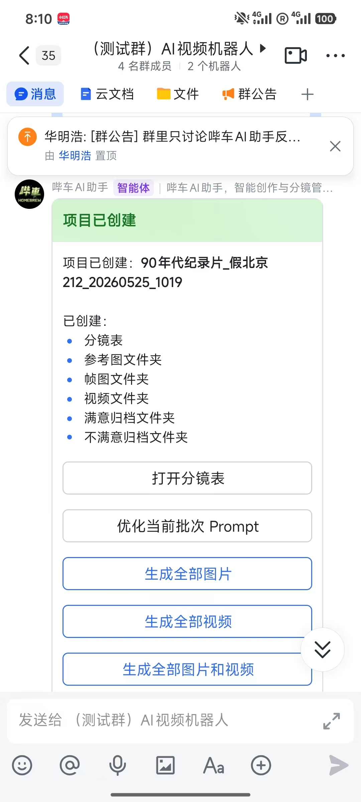
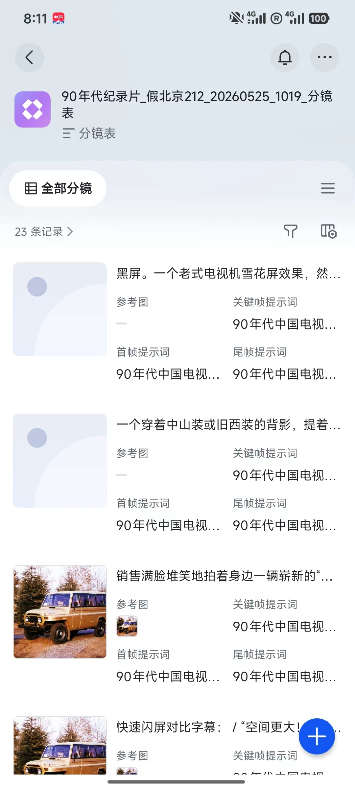
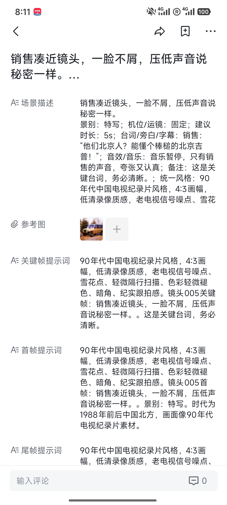
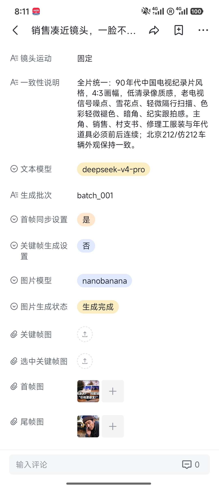
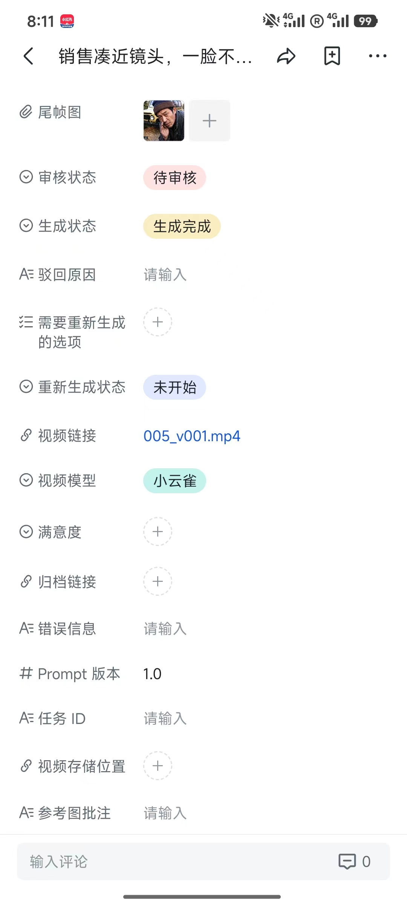
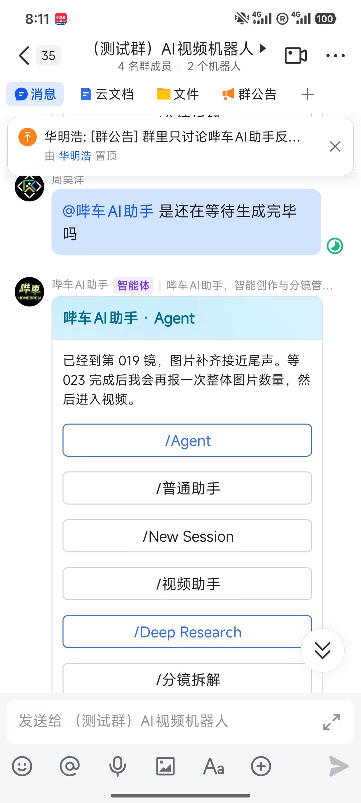

# Bicar AI Storyboard (bicar_ai_storyboard)

<div align="center">

**Feishu/Lark Bot & Bitable Multi-Agent AI Storyboard & Video Production Engine**  
*Transform scripts, documents, and reference media into shot-level storyboards, keyframe art, and AI videos.*

[Core Capabilities](#core-capabilities) • [Demo Walkthrough](#mobile-feishulark-workflow-showcase) • [Slash Commands](#frequently-used-commands) • [Production Workflow](#recommended-production-workflow) • [Architecture](#project-structure--architecture) • [Deployment](#local-setup--deployment)

</div>

---

## Overview

**Bicar AI Storyboard** is an enterprise-grade AI production workflow engine integrated directly with **Feishu (Lark)**. By combining interactive chat bots, autonomous agents, and Feishu Bitable (multidimensional spreadsheets), the system automates the complete film and commercial pre-production pipeline.

The platform decomposes long scripts, docx briefs, and Feishu documents into shot-by-shot visual specifications. It automatically orchestrates multimodal generative models (**OpenRouter**, **DeepSeek**, **OpenAI**, **DashScope**, **Google Gemini**, **Xiaoyunque**, and **Seedance**) to optimize prompts, generate first/last/keyframes, and synthesize coherent video clips while logging render statuses, error diagnostics, and media links back into collaborative cloud tables.

---

## Core Capabilities

- 🤖 **Multi-Mode Conversational Agents**: Seamless switching between General Chat, Deep Research, Storyboard Assistant, and Script Decomposition within standard Feishu chat threads.
- 📁 **Automated Project Provisioning**: One command provisions a structured Feishu Drive folder and initializes a fully formatted multidimensional Bitable workspace.
- 📊 **Collaborative Bitable Ledger**: Tracks shot descriptions, reference image attachments, optimized prompts, start/end frames, render status flags, and error logs in real time.
- 🎨 **End-to-End Multimodal Pipeline**: Coordinates text, image, and video models to perform prompt expansion, keyframe rendering, first-and-last frame interpolation, and final video rendering.
- 🌐 **Deep Research Engine**: Conducts autonomous web research on creative topics and compiles structured research reports directly into cloud Feishu documents.
- 📜 **Script-to-Storyboard Decomposition**: Ingests Feishu Docs, local docx files, or raw text manuscripts and decomposes them into granular shot-by-shot director requirements.
- 🔄 **Reverse Video Decomposition**: Ingests external videos (e.g., YouTube/Feishu links), extracts scene keyframes, runs multimodal visual analysis, and produces editable shot breakdowns.
- ⚡ **Asynchronous Background Processing**: Powered by FastAPI, Celery task queues, SQLAlchemy persistence, and persistent Feishu WebSocket event listeners.

---

## Mobile Feishu/Lark Workflow Showcase

The following gallery illustrates the complete mobile workflow inside Feishu/Lark: from invoking agent capabilities and submitting document briefs to project creation, table editing, and automated video generation.

<table>
  <tr>
    <td width="33%" align="center">
      
      <br>
      <sub>Figure 1: Agent Capabilities & Command Menu</sub>
    </td>
    <td width="33%" align="center">
      
      <br>
      <sub>Figure 2: Script Submission via Document Link</sub>
    </td>
    <td width="33%" align="center">
      
      <br>
      <sub>Figure 3: Interactive Project Creation Card</sub>
    </td>
  </tr>
  <tr>
    <td width="33%" align="center">
      
      <br>
      <sub>Figure 4: Collaborative Multidimensional Bitable</sub>
    </td>
    <td width="33%" align="center">
      
      <br>
      <sub>Figure 5: Shot Parameters & Expanded Prompts</sub>
    </td>
    <td width="33%" align="center">
      
      <br>
      <sub>Figure 6: Model Selection & Render Controls</sub>
    </td>
  </tr>
  <tr>
    <td width="33%" align="center">
      
      <br>
      <sub>Figure 7: Video Render Status & Preview</sub>
    </td>
    <td width="33%" align="center">
      
      <br>
      <sub>Figure 8: Real-Time Batch Progress Card</sub>
    </td>
    <td width="33%" align="center">
      <em>Additional operational cards accessible in Feishu</em>
    </td>
  </tr>
</table>

---

## Frequently Used Commands

```text
# Session & Mode Control
/help                          # Display command guide and available actions
/Agent                         # Enter standard Agent mode
/Agent deepseek                # Route queries through DeepSeek model
/Deep Research                 # Launch web research agent with doc generation
/New session                   # Reset conversation context

# Project Management
/新建分镜项目: [ProjectName]     # Create project folder and initialize Bitable
/切换当前项目 <BitableURL>       # Bind current chat session to existing Bitable
/查看进度                       # Query current batch generation progress

# Script Decomposition
/分镜拆解                       # Interactive script decomposition assistant
/视频拆分镜 视频=<URL> 项目名=<Name> # Reverse-engineer storyboard from video URL

# Image & Video Batch Generation
/优化当前批次 Prompt            # Expand shot descriptions into full visual prompts
/生成全部图片                   # Batch generate start frames, end frames, keyframes
/生成全部视频                   # Batch render video shots according to table status
/启动首尾帧同步                 # Enable start-and-end frame visual interpolation
/关闭首尾帧同步                 # Disable start-and-end frame synchronization
/同步表格                       # Refresh Bitable data with latest database state
```

---

## Recommended Production Workflow

```text
1. Initialize Project
   Send `/新建分镜项目: [Name]` in Feishu chat.
         │
         ▼
2. Populate Shot Descriptions
   Open the generated Feishu Bitable; enter shot descriptions,
   reference imagery, and focal annotations.
         │
         ▼
3. Expand Visual Prompts
   Issue `/优化当前批次 Prompt` to generate synchronized
   character, lighting, camera motion, and scene prompts.
         │
         ▼
4. Generate Keyframes
   Run `/生成全部图片` to produce start frames, keyframes, and end frames.
   Review image quality directly inside the Bitable.
         │
         ▼
5. Render Video Clips
   Execute `/生成全部视频` or flip individual shot status to `启动`.
         │
         ▼
6. Track Progress & Export
   Monitor execution cards via `/查看进度`; export final MP4 links
   and production assets directly from Feishu Drive.
```

---

## Project Structure & Architecture

```text
backend/
  app/
    adapters/          # Feishu API client, card templates, field mappings
    api/routes/        # FastAPI HTTP endpoints, Feishu webhook receivers
    core/              # Configuration, logging, model provider registries
    db/                # SQLAlchemy session lifecycle management
    domain/            # Domain schemas, pydantic models, and enums
    models/            # Relational database models (Projects, Shots, Assets)
    providers/         # Model adapters (DeepSeek, OpenAI, DashScope, Gemini)
    services/          # Business logic: Bot dispatch, storyboard, video pipelines
    workers/           # Celery asynchronous task workers
  alembic/             # Relational database migration scripts
  scripts/             # DevOps, operational automation, and WebSocket runners
  tests/               # Unit, integration, and end-to-end test suites
docs/assets/           # Documentation screenshots and visual assets
```

---

## Local Setup & Deployment

### Prerequisites

- Python 3.11+
- PostgreSQL or SQLite
- Redis (for Celery background workers)
- Registered Feishu Custom App credentials (App ID & App Secret)

### Installation

```bash
cd backend

# Create virtual environment
python3 -m venv .venv311
source .venv311/bin/activate  # On Windows: .\.venv311\Scripts\activate

# Install dependencies
pip install -r requirements.txt

# Configure environment variables
cp .env.example .env

# Run database migrations
alembic upgrade head

# Start FastAPI server
uvicorn app.main:app --reload --host 127.0.0.1 --port 8000
```

### Launch Feishu WebSocket Daemon

For deployments without public inbound webhooks, run the official persistent WebSocket client:

```bash
python scripts/run_feishu_ws.py
```

### Automated Testing

```bash
cd backend
python -m pytest
```

---

## Security & Secrets Policy

API keys, Feishu application secrets, database connection strings, and local storage credentials must be specified via `.env` configuration. Version control tracks only `.env.example` containing empty parameter definitions.
